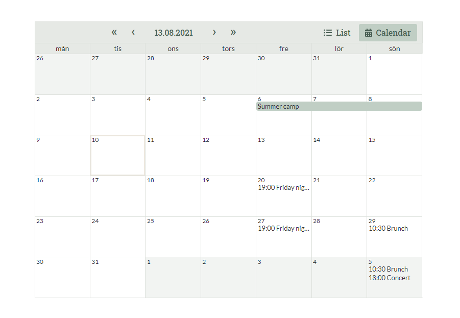

# Vue Google Calendar with custom styling

## Introduction

This is a rather lightweight calendar that fetches gcal events and outputs them in a styleable calendar-list component.

The calendar is based on https://github.com/richardtallent/vue-simple-calendar/

## Requirements

In your package.json-file, you need these requirements:

```HTML
	"dependencies": {
        "jquery": ">=3.4.1",
		"vue": ">=3.0.0",
		"vue-simple-calendar": "^5.0.0",
        "vuejs-datepicker": "^1.6.2"
	},
    "devDependencies": {
        "vue-loader": ">=15.7.0",
        "vue-template-compiler": ">=2.6.11"
    }
```

## Usage

**Important** This is NOT a standalone component that can be used with composer or npm. By merely copypasting the code into your project, you are free to edit & style it however you wish.
Also, if you are new to Vue, save yourself some headache and go with the default google calendar embed.

Copypaste the vue & scss-code into your project and register the `EventCalendar` Vue component. Then you are able to embed it e.g. in a template or a WP custom block like this:

```HTML
<?php
$translations = [
    'moreinfo' => 'More information',
    'list' => 'List',
    'calendar' => 'Calendar',
];
$params = [
    'translations' => $translations,
    'language' => 'en',                         // current language
    'calendar_email' => $calendar_email,
    'calendar_api_key' => $calendar_api_key,
    'calendar_preset_mode' => 'calendar',       // 'calendar' or 'list'
    'allow_mode_switch' => true,
];
?>
<event-calendar name="event-calendar" :params='<?php echo json_encode($params); ?>'></event-calendar>
```

### Credentials

`$calendar_email` : The email address that "owns" the calendar
`$calendar_api_key` : The calendar's public API key, starting with "AIzaSy".

You can find these credentials by checking the developer console on a page where the calendar is embedded.
In the Networks-tab, search for an XHR-request that starts with "events?calendarId=...". In the request name you find both credentials:
`https://clients6.google.com/calendar/v3/calendars/{{ calendar_email }}/events?calendarId={{ calendar_email }}&...&key={{ calendar_api_key }}`


## Limitations

Since this is not a proper google calendar embed, it lacks some features that can be found in traditional google embeds.

- No agenda view
- No print feature
- No copying to other google calendars
- And obviously no adding / editing events

Also

- The calendar view does not deal well with many events per day

This is merely a way of displaying a nicely styled calendar until the default old-fashioned google calendar embed becomes styleable.



